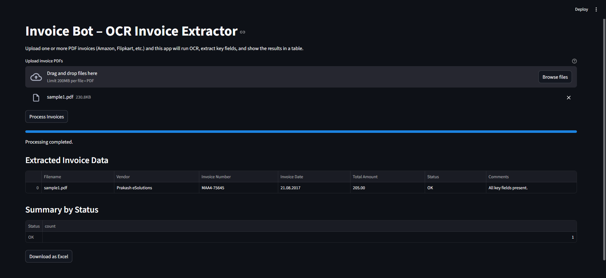

# Invoice Bot – Automated Invoice Extraction System (Python + OCR + RPA)

The **Invoice Bot** is an end-to-end automation system that reads PDF invoices  
(Amazon, Flipkart, and generic invoices), extracts key fields using OCR,  
parses structured information, validates the results, and exports clean data  
into an Excel report—similar to a production-grade RPA RNM workflow.

---

## Features

### OCR-Based Extraction
- Converts PDF pages to images using **pdf2image**
- Uses **Tesseract OCR** to extract raw invoice text
- Handles multi-page invoices

### Smart Field Parsing
Extracts:
- **Vendor / Sold By**
- **Invoice Number**
- **Invoice Date**
- **Total Amount** (supports comma values like `1,279.00`)

Parsing logic supports:
- Amazon invoice formats  
- Flipkart invoice formats  
- Custom/trucking invoices  
- Multiple "Total" label variations:  
  `TOTAL`, `TOTAL AMOUNT`, `TOTAL PRICE`, `GRAND TOTAL`, etc.

### Data Validation
Each processed invoice gets a validation status:
- **OK** – All fields extracted successfully  
- **WARNING** – Missing or unclear fields with comments  
- **ERROR** – Could not extract required fields

### Excel Output
Generates a clean Excel file:
`output/invoice_data.xlsx`
```
Columns:
- Filename  
- Vendor  
- Invoice Number  
- Invoice Date  
- Total Amount  
- Status (OK / WARNING / ERROR)  
- Comments
```

### Logging
All steps are logged to:
`logs/invoice_bot.log`

Including extraction decisions, missing fields, and processing outcomes.

---

## Project Structure

```
invoice_bot/
│
├── invoices/ # Input PDFs
├── extracted_text/ # OCR text output for debugging
├── output/invoice_data.xlsx # Final report
├── logs/invoice_bot.log # Processing logs
│
├── main.py # Main orchestrator (OCR + parsing + export)
├── invoice_parser.py # Regex & rule-based extraction logic
├── utils.py # Logging + validation helpers
├── requirements.txt # Dependencies
└── README.md # Documentation
```


---

## Installation & Setup

### Clone the repository
```bash
git clone https://github.com/Karangarg01/invoice_bot.git
cd invoice_bot
```
### Create a virtual environment
```
python -m venv .venv
```
Activate:
```
.venv\Scripts\activate    # Windows
```
### Install dependencies
```
pip install -r requirements.txt
```
### Install Poppler (Required for pdf2image)

Download Poppler for Windows:
[Click Me!](https://github.com/oschwartz10612/poppler-windows/releases/)

Extract to:
```
C:\poppler\Library\bin
```

Add the above path to your `System Environment PATH`.

### Add your invoices

Place all PDF files into:
`invoices/`

### Run the Invoice Bot
```
python main.py
```

Output files generated:

- `extracted_text/<invoice>.txt`
- `output/invoice_data.xlsx`
- `logs/invoice_bot.log`

---

## How It Works (High-Level Architecture)

1. OCR Layer
- PDF → Images → Text (via Tesseract)

2. Parsing Layer
- Regex + rule-based extraction
- Handles multiple invoice formats
- Custom heuristics for total amount detection

3. Validation Layer
- Checks missing or ambiguous fields
- Assigns status + comments

4. Export Layer
- Builds final DataFrame
- Saves Excel file for further use

5. Logging Layer
- Tracks extraction, warnings, and errors
This mirrors real-world RPA RNM (Run & Maintain) automation patterns.

## Technologies Used

- Python
- Tesseract OCR
- pdf2image
- pandas
- regex (re)
- openpyxl
- logging
- RPA-inspired validation flow

## Conclusion

Invoice Bot is a robust automation script capable of processing
multiple invoice formats, extracting structured data, validating results,
and generating a clean Excel report — ideal for RPA, finance automation,
and real-world data extraction tasks.
